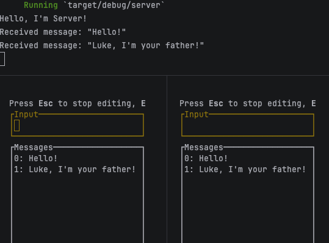

# Simple Chat App in Rust

## STAGE 1: One room terminal text chat (unencrypted)

## Functional Requirements

0. Web3 wallet authorization
1. Direct Messaging Chat
2. Group Chat
3. Read Receipts
4. Online Status
5. Notifications
6. Share Multimedia
7. P2P messaging

## System Requirements
1. Low Latency
2. High Reliability
3. High Availability
4. Mobile & Web
5. Chat History Storage
6. Handle Huge Amount of Data
7. E2E encryption